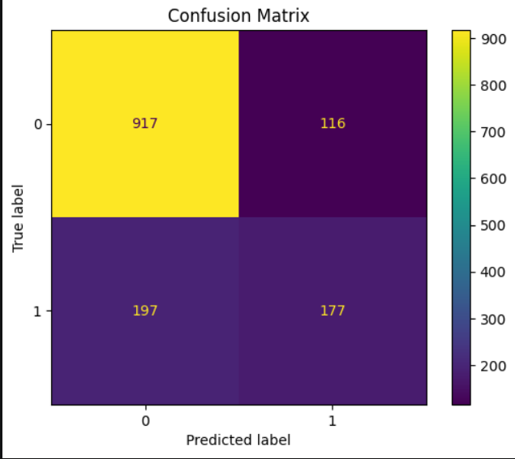

Customer churn prediction system built using machine learning and deployed via a Streamlit interface. The project analyzes telecom customer behavior to identify key churn drivers and generate predictive insights.
## Model Performance

Accuracy: 0.78  
Precision: 0.70  
Recall: 0.55  
F1 Score: 0.61  
ROC-AUC: 0.84

The model demonstrates good predictive capability for identifying customers at risk of churn. Recall is particularly important in churn prediction because missing a potential churner has higher business cost.
## Sample Visualizations

### Churn Distribution

### Prediction Example

